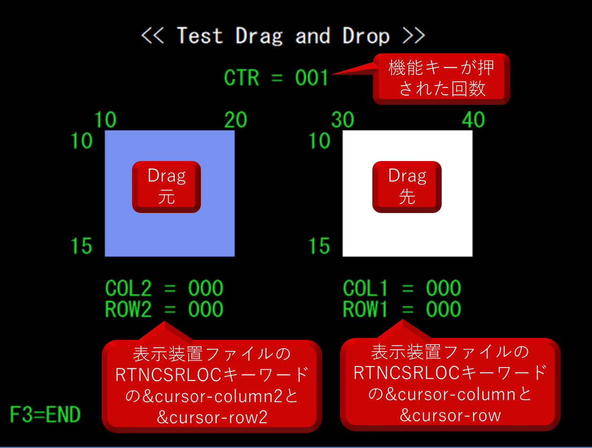
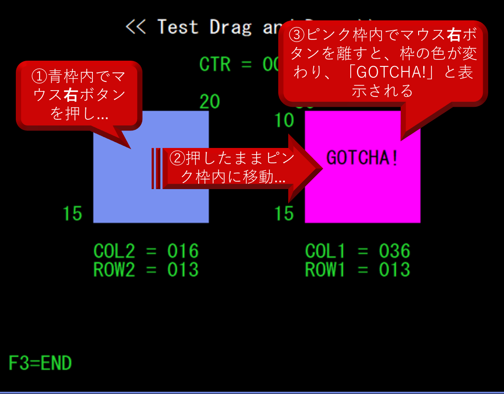
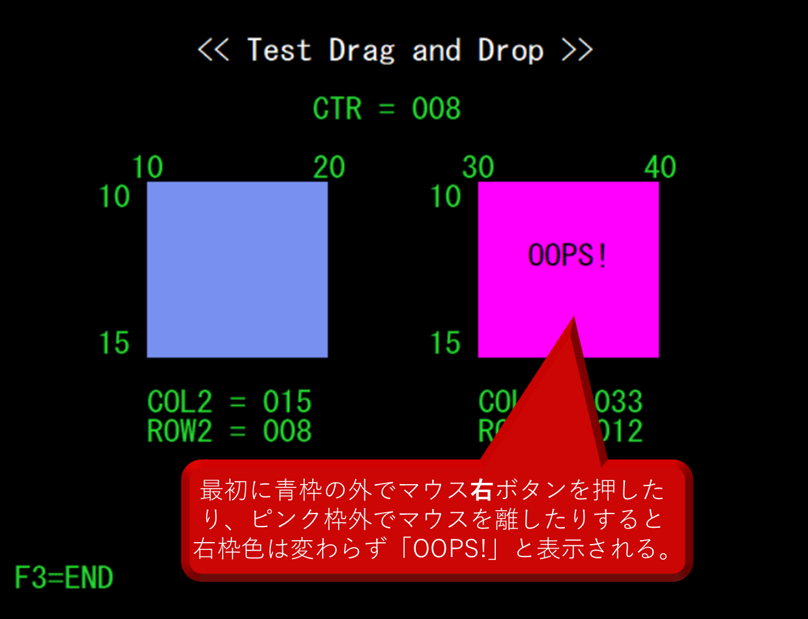

## DDSのMOUBTNとRTNCSRLOCキーワードを利用した5250画面でのドラッグ&ドロップ

DDSで下記の定義を行い、マウス(この例では右ボタン)でドラッグ&ドロップを行う。

> [!CAUTION]
> 5250エミュレーターによっては正常に動作しない場合がある。各キーワードがサポートされているかは5250エミュレーターの提供元に要確認。

- MOUBTN(*URP *URR ENTER)
  - リーディング・エッジ事象に「*URP」(シフトされていない右ボタンを押した)、トレーリング・エッジ事象に「*URR」(シフトされていない右ボタンを放した)を指定。トレーリング・エッジ事象が受信されると「ENTER」イベントが発生する
  - 詳細は https://www.ibm.com/docs/ja/i/7.6.0?topic=80-moubtn-mouse-buttons-keyword-display-files を参照

- RTNCSRLOC(*MOUSE &GROW1 &GCOL1 &GROW2 &GCOL2)
  - *MOUSEを最初のパラメーターとして指定しており、変数&GROW1および&GCOL1には、入力時にカーソルが置かれている行・桁番号が入る。変数&GROW2および&GCOL2には、2イベント・マウス定義の最初のイベントが発生したときのカーソルの行・桁番号が入る。
  - 詳細は https://www.ibm.com/docs/ja/i/7.6.0?topic=80-rtncsrloc-return-cursor-location-keyword-display-files を山荘
  - 実際に試すと最初の事象(マウス右ボタン押下)した時の行・桁が&GROW2/&GCOL2に、2番目の事象(マウス右ボタンを話す)した時の行・桁が&GROW1/&GCOL1に設定される？

 

***
 

画面ファイルDADDとILE-RPGプログラムDADRをコンパイルして実行すると、下記のような動作となる。

